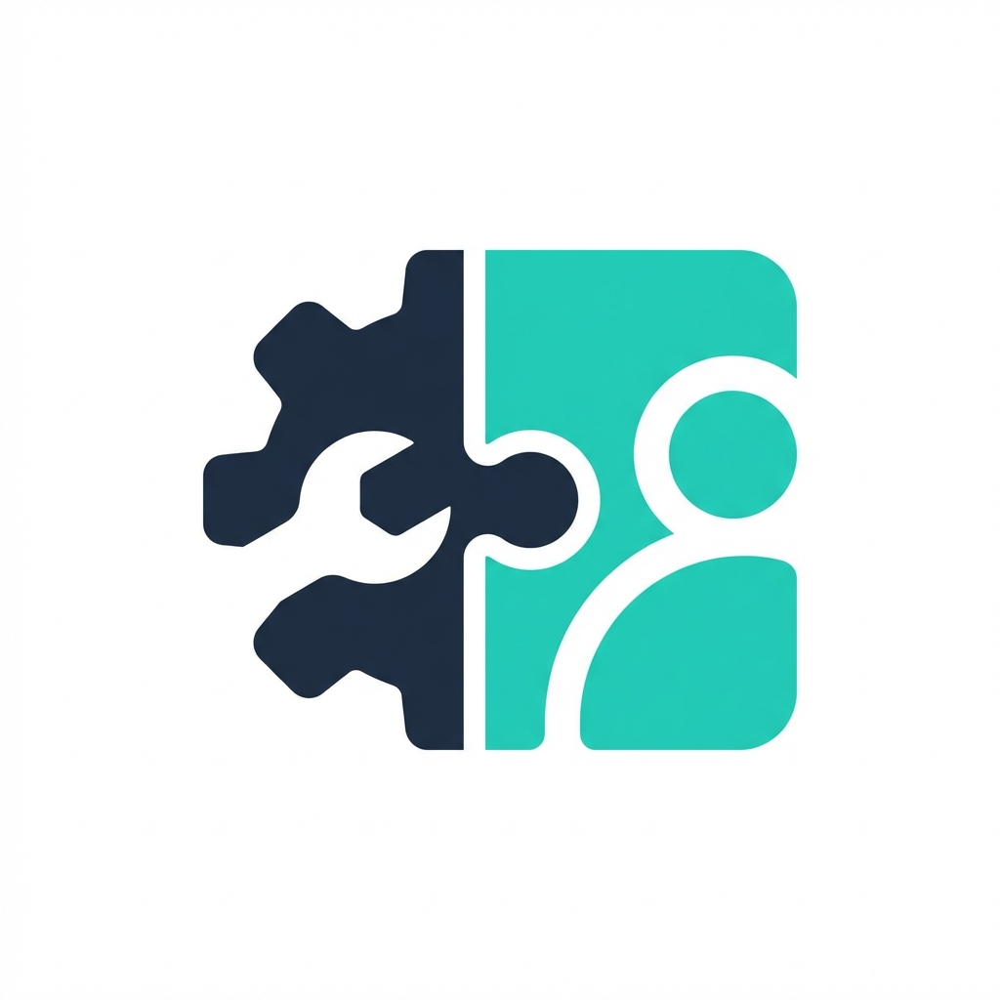

<p align="center">
  
</p>

<h1 align="center">The AI Agent Contract Stack</h1>

<p align="center">
  <strong>The definitive, execution-agnostic governance framework for the Agentic Economy.</strong><br>
  A dual-layer protocol for <strong>Capabilities</strong> (UTCD) and <strong>Behavior</strong> (ABC/Contracts).
</p>

<div align="center">
  
  
  
</div>

---

## 🏗️ The Architecture

The **AI Agent Contract Stack** provides a standardized way for AI systems to interact safely. It separates the **description of tools** from the **governance of agents**.

### Layer 1: UTCD (Capabilities)
**"What is this tool and what are its risks?"**
UTCD provides a declarative "Nutrition Label" for tools. It allows agents to reason about side-effects, privacy, and costs **before execution**.

> *Stored in: `examples/*.utcd.yaml`*

### Layer 2: ABC (Contracts)
**"How is this agent permitted to behave?"**
Agent Behavior Contracts (ABC) define the enforceable boundaries—MISSION, RISK, and GOVERNANCE—that an agent must respect during its lifecycle.

> *Stored in: [contracts/](contracts/) directory*

---

## � Quick Start

### 1. Tool Capability Validation (UTCD)
Ensure your tool's "Nutrition Label" follows the standard schema:
```bash
python -m utcd.validator examples/csv-analyzer.utcd.yaml
```

### 2. Behavioral Integrity Validation (ABC)
Validate an agent's behavioral contract and verify tool risk inheritance:
```bash
python -m utcd.contract_validator contracts/examples/research-agent.contract.yaml
```

### 3. Cryptographic Signing
Secure your tool descriptors to prevent "Shadow Capability" tampering:
```bash
python demos/sign_descriptor.py examples/csv-analyzer.utcd.yaml
```

---

## 🧠 Reasoning Agent Example

The `utcd` package includes a built-in reasoning engine that selects tools based on your governance policy.

```python
from utcd import UTCDAgent, Policy

# 1. Initialize with a governance policy (e.g., GDPR compliant)
agent = UTCDAgent(policy=Policy.gdpr())

# 2. Discover tools
agent.load_tools_from_directory("./examples")

# 3. Find the safest tool for the mission
results = agent.find_tools(domain="data-processing")
best_tool = results[0]

print(f"Selected: {best_tool.tool_name} (Score: {best_tool.score}/100)")
```

---

## 📁 Project Structure

| Directory | Purpose |
|-----------|---------|
| [**utcd/**](utcd/) | The core Python package (Loader, Validator, Signer, RiskEngine). |
| [**contracts/**](contracts/) | **Agent Behavior Contracts (ABC)** specifications and examples. |
| [**schema/**](schema/) | Formal JSON Schema definitions for core and profiles. |
| [**examples/**](examples/) | Sample UTCD tool descriptors. |
| [**demos/**](demos/) | Ready-to-run scenarios (Selection, Rejection, Degradation). |

---

## 🔐 Built-in Policies

| Policy | Scope | Enforcement |
|--------|-------|-------------|
| `Policy.strict()` | Safety | Rejects any tool with side-effects or data retention. |
| `Policy.standard()` | Balanced | Standard safety defaults with performance weighting. |
| `Policy.gdpr()` | Compliance | Enforces EU data residency and encryption standards. |
| `Policy.permissive()` | Audit | Provides warnings without blocking execution. |

---

## 📖 Key Principles

1.  **Pre-execution only** — We describe, never execute.
2.  **Static & Declarative** — Machine-readable YAML, no runtime dependencies.
3.  **Offline-Valid** — Guaranteed safety without network calls.
4.  **Immutable Trust** — Canonical hashing prevents tampering after signing.
5.  **Agent-Centric** — Designed to be ingested by LLMs for autonomous reasoning.

---

## � Documentation

- [**WHITEPAPER.md**](WHITEPAPER.md) — The philosophical and technical foundation.
- [**contracts/contract-spec.md**](contracts/contract-spec.md) — Formal ABC specification.
- [**FUTURE_ROADMAP.md**](FUTURE_ROADMAP.md) — Our plan for an Agentic Governance ecosystem.

---

<p align="center">
  Developed by <strong>Rajan</strong> | Released under <strong>MIT License</strong>
</p>
